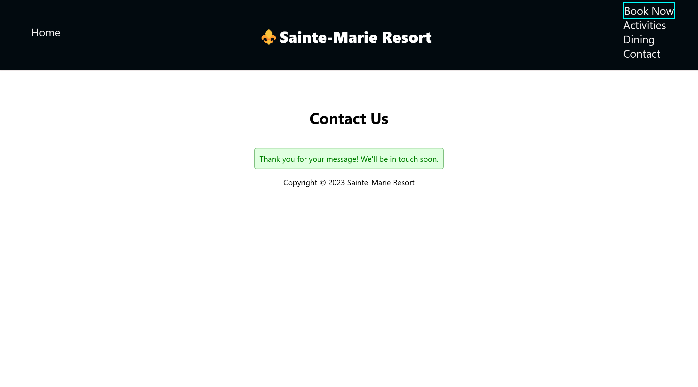

# Holiday Resort web application

# About

 Provides information and access to booking through a caribbean resorts personal website. The resort is named "Sainte Marie"

# Overview of website
* Homepage / Navbar
* Book-now
* Activities
* Dining
* Contact

# Homepage/Navbar
* Opening page to site that provides brief description of resort.
* Navbar includes selection of options to choose.
* React-router-dom package added to bind pages using React-Router

# Book-now
* Slideshow of available rooms in hotel:
  
1. Standard Room

  
2. Luxury Room

  
3. Penthouse

* Interactive calendar:
  
Allows user to select:

  
1. Dates for occupancy

  
2. Number of persons in party

  
3. Room selection

* After selections are provided, the booking details are prompted in full to generate below the calendar. The booking details include:

  
1. Check-in/Check-out dates

  
2. Number of persons

  
3. Room Type

  
4. Price per night (Standard Room: $50 / Luxury Room: $100 / Penthouse: $150)

  
5. Total cost based on selections chosen

  
6. Dates before current date cannot be selected

  
# Contact Page
* Name / Email / Message inputs
* Prompts response when message is recieved with all requirements completed

# Screenshots
<h2>Homepage</h2>

<h2>Booking Page</h2>

<h2>Booking Page with dates selected - booking details available</h2>

<h2>Contact Page</h2>

